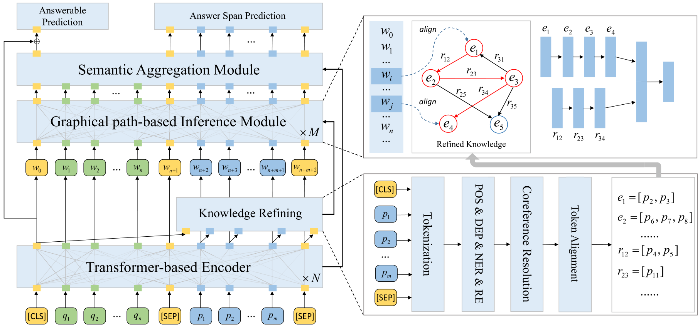

# RI-Net: Improving Machine Reading Comprehension via Structural Knowledge Refining and Graphical path-based Inference

## 摘要

> Machine Reading Comprehension (MRC) is a challenging task in NLP, which requires machine to answer the question accurately based on a given passage. Traditional neural-based end-to-end model have achieved remarkable success, however, it still hard to outperform human beings on the long text with complex inner logic knowledge. To alleviate this problem, we propose RI-Net, which consists of structural knowledge \textbf{R}efining and graphical path-based \textbf{I}nference. Specifically, we introduce a pipeline method to refine inner structural knowledge, which contains entity mentions, referential resolution and entity relations. In this case, the passage can be transformed into an explicit knowledge graph. Then, we align each token of question and passage to the node of knowledge graph, and utilize deep Transformer to calculate the attentive correlation based on the graphical path representation. We believe this would combine the merits of both inner knowledge and raw text towards better MRC. To verify its effectiveness, we conduct experiments on widely used SQuAD2.0 and NewsQA. The results show that the proposed RI-Net helps achieve substantial performance improvement over other baselines.

## 动机：

&emsp;&emsp;机器阅读理解旨在根据问题（Question）从给定的段落（Passage）中寻找答案，通常答案是一个简短的短句、短语或词组。现阶段工作基于RNN、CNN以及attention等有效捕捉问题和段落之间的token语义关系。但依然存在一些不足之处包括：
（1）对于较长的问题或复杂的段落，尤其是对于包含大量实体事件并混合大量指代词时，传统的方法已经无法理解段落所描述的语义信息，因此需要提取段落中的结构知识，并实现显式的推理；
（2）先前有工作通过引入外部结构化知识（例如ConceptNet、FreeBase等）进行数据和语义增强，提升了预测的效果，但通常段落内并非所有的实体都出现在特定知识库中，且外部知识不可避免的引入大量冗余的噪声，破坏了段落自身所描述的结构信息；
（3）先前的知识融合均基于token的检索方式，即遍历每个token时从知识库中通过规则或相似度方式进行检索，其存在两个问题，一方面并非所有的token是知识库中的实体，且其无法对指代类实体进行解析；另一方面每个token的检索时相互独立的，没有考虑到token之间自身的语义关系；

&emsp;&emsp;据我们所知，现阶段将知识库融入文本理解和推理的方式是基于token且独立进行的，虽然对于每个token都可以融入外部更丰富的语义，但忽略了其他token的相关性。虽然部分方法通过再次添加一层self-matching来进行信息聚合，但推理的过程则被弱化。因此我们认为应该充分利用文本自身的结构化知识来显式地提升推理能力

&emsp;&emsp;例如：句子“Obama was born in Honululu.”，先前的知识库融合方式仅会分别检索Obama和honululu两个实体，而was、born和in在知识库中并非是实体；另外先前工作在检索时每个token是相互独立的，而该句子自身的结构知识（Obama，was born in， honululu）却没有被显式被提取并进行推理；

&emsp;&emsp;因此为了改进先前的机器阅读理解，本方案旨在引入外部知识增强的同时，将passage进行知识提炼形成结构化信息来辅助模型推理复杂的语义，方法步骤包括：
（1）使用预训练的BERT语言模型提升对问题和段落的交互；
（2）使用自动抽取工具对段落进行信息抽取，包括词性标注、实体抽取、指代消解、关系抽取，并最终构建段落的结构化知识；
（3）提出Knowledge-aware Inference Network（KI-Net），通过将结构化知识融入到阅读过程中并实现推理；

## 贡献：
（1）通过信息抽取工具（包括词性标注、实体识别、句法分析、指代消解等）自动从段落中抽取结构化三元组知识作为显式的推理资源。在不额外引入外部资源的情况下实现对复杂段落的推理；
（2）提出一种KI-Net，将结合结构化知识充分融入到推理的过程中，以提升在复杂的段落中进行问答的性能和解释性；
（3）在SQuAD2.0和NewsQA等数据集上进行验证；

## 挑战与思考：
（1）如何对复杂的段落提炼出结构化的知识？
（2）如何保持段落知识结构的情况下实现推理？

## 详细步骤（模型架构）：

#### 1、Transformer-based Encoder
（1）使用BERT对输入的question和passage进行编码，输入格式为[CLS],Q,[SEP],P,[SEP]，使用BERT自带的word piece、position embedding和segment embedding。
（2）[CLS]对应的输出向量喂入一个全连接层得到对应的是否有答案的概率分布loss1，并计算对应的得分；这部分可以理解为在初次结合question阅读passage时进行判断是否可能存在答案。

#### 2、Knowledge-aware Refining Module
&emsp;&emsp;我们从两个粒度上进行知识提炼，分别是实体关系层面上的结构化知识（Entity-Relation-aware knowledge)和语法层面上的知识（Syntax-aware knoweldge）
（1）根据原始的passage，使用spacy进行分词、词性标注、实体识别、指代消解和句法分析，并选择ICML2019竞赛第一名的方法构建passage-level的知识图谱。每个结点可能对应BERT输入的多个word-piece，因此每个结点添加几个属性，包括：
- 整个token的序列：结点的初始化向量表示则为这些token在BERT输出部分的平均值；
- 其在passage中的起始位置：直接获得这些token起始和末尾两个位置对应BERT输出的向量并进行拼接；
- 词性标注：初始化一个词性标注的lookup table
- 实体类型：初始化一个实体类型的lookup table；
结点的表示则为上述四个特征拼接后的结果，为了保证维度一致，将其喂入一个全连接层。
（2）新增一个结点[CLS]：该结点表示[CLS]的token，该结点与所有其他结点相连，边为unlabeled；每个结点带有自环，自环边记做 self-loop
（3）我们发现大多数passage中的token都包含在了三元组中，但少数token没有被提炼出，因此为了避免这部分信息的丢失，我们额外使用依存句法分析（或AMR抽象语义表示）作为语法层面的知识

#### 3、Graphical path-based Inference Module
（1）为了能够充分利用结构知识，并融入到模型中进行推理，我们设计让question和passage中每个token之间通过图谱实现推理。例如在例子“Obama was born in honululu”中，“Obama”和“honululu”两个token则可以根据图谱寻找最短路径并实现推理。
（2）使用Transformer架构，在计算attention时，对出现在图谱中的token，根据最短路径进行表征并计算权重，最终得到权重矩阵并进行加权求和，其次加入add&layernormal以及残差；

&emsp;&emsp;需要特别说明的是：
- 如果question和passage中的多个token对应图谱中的同一个实体结点，则在计算这些token之间的相关性attention时，直接视为同一个图谱中同一个实体结点自身的attention（相当于添加一个自环，边关系记做“self-loop”）；
- 如果question和passage中的多个token对应图谱中的同一个关系边（关系词也可能是一个或多个token，对于可能多个三元组上边都是同一个token情况，例如（A,is,B）和（c,is,d），is关系需要区分，因为其对应文本中的是多个不同的is），此时路径只表示到边，为了保证完整性，两头都补齐对应的头尾实体。
- 上述两个情况中，对于部分token之间都会对应同一个推理路径，因此为了区分不同token，在推理过程中，除了使用node和relation的embedding外，再拼接token自身的embedding，这样即便是不同的token对应相同的推理路径，也会得到不同的表示和权重，同时同一个推理路径也会得到充分的更新；
- 对于一些token是指代类词（例如he，it），实现会将其对应到指代的实体上，在更新时仍然使用原始代词的embedding，但更新推理时则结合对应的知识，因此缓解指代词无法推理的问题；
- 对于question和passage中没有出现在图谱（包括实体结点和边上的关系）的token（word-piece，[SEP]）【在实验中要统计这类token的分布情况，说明只有包括标点符号等少量的token是不在图谱中，说明其对推理并没有太大作用】，在使用Transformer进行计算时，这类token将会被mask掉；

（4）使用多层实现对图的多次迭代，且同时对BERT的输出进行了更新，即成功地将KB融合到了推理过程中，让模型充分理解复杂的文本的语义，且避免指代类词无法准确寻找对应知识难以推理的问题；该模块最终输出每个token的表征向量

#### 4、Semantic Aggregation Module

&emsp;&emsp;通过门控单元，对token级别和推理级别的信息表征进行融合

#### 5、Prediction Output
（1）将[CLS]对应的表征再次喂入一个全连接层得到一个得分和loss2，并结合Module1的loss1训练当前问题是否包含答案；
（2）使用原始的BERT的问答模块输出start和end的概率分布，并得到对应的loss3，三个loss结合进行训练；

## 参考文献：
- Machine Reading Comprehension Using Structural Knowledge Graph-aware Network（2019EMNLP）
- Enhancing Pre-Trained Language Representations with Rich Knowledge for Machine Reading Comprehension（2019ACL）
- Improving the robustness of machine reading comprehension model with hierarchical knowledge and auxiliary unanswerability prediction（2020）

